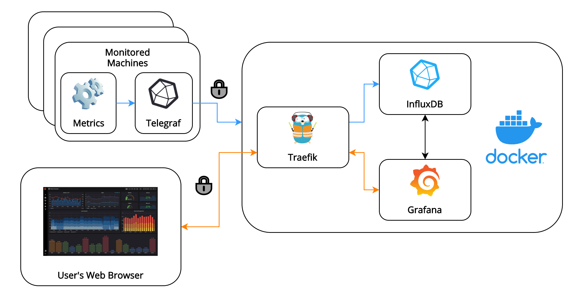

# Secure Monitoring Solution in Docker



Docker Compose application for deploying [InfluxDB](https://www.influxdata.com/products/influxdb-overview/), [Grafana](https://grafana.com/) and [Traefik](https://containo.us/traefik/) in Docker containers.

The individual components are:

- **InfluxDB**: time-series database.

- **Grafana**: front-end for visualizing and querying data in InfluxDB.

- **Traefik**: edge router/reverse proxy which will auto-generate and auto-renew TLS certificates using [Let's Encrypt](https://letsencrypt.org/). This means that all data sent to and from Grafana and InfluxDB will be encrypted.

## Prerequisites

- [Docker](https://docs.docker.com/get-docker/)

## How to run locally

Deploy the `docker-compose` application:

```bash
docker-compose up
```

You can then access Grafana at [monitoring.docker.localhost](http://monitoring.docker.localhost). Use the credentials in [.env](.env) to log in to Grafana. InfluxDB will be listening on port `8086`.

Grafana is accessible from the HTTP and HTTPS ports (`80` and `443` respectively), with redirection from HTTP to HTTPS using Traefik [routers](https://doc.traefik.io/traefik/routing/routers/).

> Note that when accessing Grafana or InfluxDB that have been deployed locally, your browser and other apps may show warnings about invalid or self-signed TLS certificates. This is expected as localhost domains don't end with a valid top-level domain, so Traefik won't attempt to request a certificate for them.

## General info

- Grafana will automatically be set up with InfluxDB as a data source (set up under `grafana/provisioning/datasources/influxdb.yml`).

- Most settings that should be tweaked are provided in [`.env`](./.env).

- InfluxDB will run shell scripts in `docker-entrypoint-initdb.d` on startup.

- If you're testing locally, and an application which you want to use to send data to InfluxDB can't be set to ignore TLS certificates, change the `traefik.http.routers.influxdb-ssl.tls` label to `false` for the InfluxDB container inside `docker-compose.yml`.

## Deploying in production

- Set containers to restart automatically when shut down by uncommenting the `restart: always` lines under every container in [`docker-compose.yml`](./docker-compose.yml)

- Make sure to set a secure password for Grafana and InfluxDB!
  - For extra security, passwords can be managed with e.g. [Docker secrets](https://docs.docker.com/engine/swarm/secrets/) or [Ansible Vault](https://docs.ansible.com/ansible/latest/user_guide/vault.html).

- Change the `MONITORING_DOMAIN` environment variable in [`.env`](./.env) to the domain where the application will be hosted.

- Set the `LETS_ENCRYPT_EMAIL` environment variable in [`.env`](./.env) to a valid email that you wish to receive emails about [certificates issues to](https://cert-manager.io/docs/configuration/acme/#creating-a-basic-acme-issuer).

- Uncomment the appropriate `CA_SERVER` environment variable in [`.env`](./.env) to use [Let's Encrypt's](https://letsencrypt.org/) production API.

    > There is a limit of 5 certificates per week from Let's Encrypt's production server as stated [here](https://letsencrypt.org/docs/rate-limits/). For more info on the Let's Encrypt staging environment and Traefik, check the note under this [Traefik docs page](https://docs.traefik.io/v2.0/user-guides/docker-compose/acme-tls/#setup).

- Run the `docker-compose` application in the background

  ```bash
  docker-compose up -d
  ```

## Useful commands

Check container logs

```bash
sudo docker container logs <CONTAINER NAME OR ID> [--follow]
```

Check where data is stored (Docker volumes)

```bash
$ sudo docker volume ls

DRIVER          VOLUME NAME
local           monitoring_grafana-lib
local           monitoring_influxdb-lib
local           monitoring_traefik-data
```

Attach to a container and use bash within it (useful for InfluxDB database maintenance)

```bash
sudo docker exec -it <CONTAINER NAME OR ID> /bin/bash
```

Start up the the InfluxDB CLI when attached to the InfluxDB docker container

```bash
influx --username <InfluxDB username> --password <InfluxDB password>
```

Check space used by Docker containers

```bash
sudo docker system df --verbose
```

## Links

- [How to backup and restore InfluxDB database from Docker containers](https://www.influxdata.com/blog/backuprestore-of-influxdb-fromto-docker-containers/)
